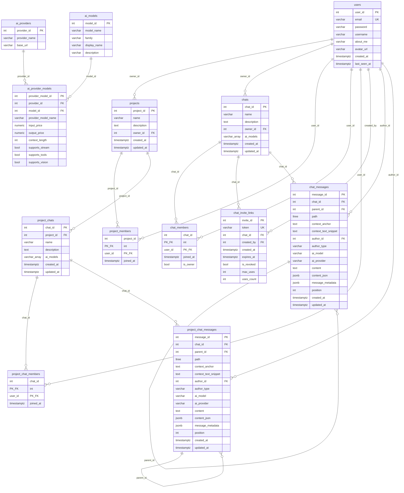
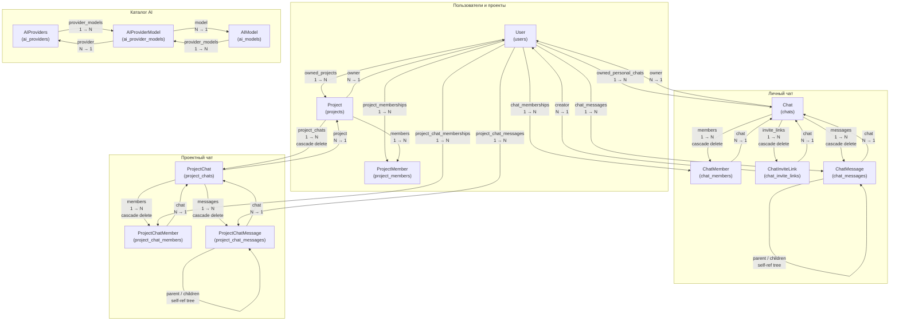
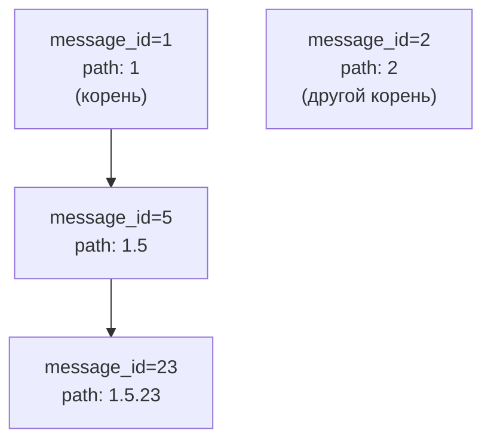
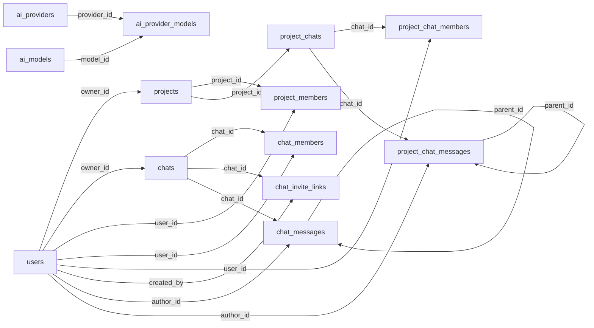

# ORM-модели

Документация по схеме базы данных приложения **AI Aggregator**.

Исходный код: [`backend/src/models/orm_models.py`](../backend/src/models/orm_models.py)

Стек: **SQLAlchemy 2.0**, **PostgreSQL**, расширение **`ltree`** для дерева сообщений.

---

## Обзор

Схема делится на четыре логических блока:

| Блок | Таблицы | Назначение |
|------|---------|------------|
| Пользователи и проекты | `users`, `projects`, `project_members` | Аккаунты, рабочие пространства, участники проекта |
| Чаты | `chats`, `project_chats`, `chat_members`, `project_chat_members`, `chat_invite_links` | Личные и проектные чаты, участники, инвайт-ссылки личных чатов |
| Каталог AI | `ai_providers`, `ai_models`, `ai_provider_models` | Провайдеры, модели, тарифы и возможности |
| Диалог | `chat_messages`, `project_chat_messages` | Деревья сообщений в личных и проектных чатах |

Всего **13 таблиц**.

### Два типа чатов

Личный чат и проектный чат **не связаны между собой**.

| | Личный чат | Проектный чат |
|---|---|---|
| Таблица | `chats` → `Chat` | `project_chats` → `ProjectChat` |
| Связь с пользователем | `owner_id` + участники через `ChatMember` | через `ProjectMember` → `Project`; участники чата — `ProjectChatMember` |
| Участники | `ChatMember` (только личные чаты) | `ProjectChatMember` (только проектные чаты) |
| Инвайты | `ChatInviteLink` | нет |
| Сообщения | `chat_messages` → `ChatMessage` | `project_chat_messages` → `ProjectChatMessage` |

Иерархия данных:

```
Личный чат:
  User → Chat → ChatMessage → ChatMessage (parent / children)
  User → ChatMember → Chat
  User → ChatInviteLink → Chat

Проектный чат:
  User → ProjectMember → Project → ProjectChat
  User → ProjectChatMember → ProjectChat → ProjectChatMessage → …
```

> Прямого `owner_id` у `ProjectChat` нет. `ProjectChatMember` задаёт участников чата; пользователь должен быть в `ProjectMember` (проверка на уровне приложения).

---

## ER-диаграмма (полная)



---

## Диаграмма связей ORM



> **Примечание.** Таблицы каталога AI не связаны FK с сообщениями. Поля `ai_model` и `ai_provider` в сообщениях хранятся как строки (денормализация для истории чата).

---

## Дерево сообщений

Дерево веток одинаково устроено в `ChatMessage` и `ProjectChatMessage`: self-reference через `parent_id` и материализованный путь `path` (тип `ltree`).



Путь `1.5.23` читается так:

- `1` — корневое сообщение #1
- `5` — потомок #5 от сообщения #1
- `23` — потомок #23 от сообщения #5

Для работы типа `ltree` в PostgreSQL требуется расширение:

```sql
CREATE EXTENSION IF NOT EXISTS ltree;
```

Скрипт [`backend/src/utils/create_tables.py`](../backend/src/utils/create_tables.py) включает его автоматически.

---

## Таблицы и поля

### `users` — `User`

Пользователь системы. Владелец проектов и личных чатов; к проектным чатам получает доступ через членство в проекте и `ProjectChatMember`.

| Поле | Тип | Ограничения | Описание |
|------|-----|-------------|----------|
| `user_id` | `INTEGER` | PK, autoincrement | Уникальный идентификатор |
| `email` | `VARCHAR(255)` | NOT NULL, UNIQUE | Логин (email) |
| `password` | `VARCHAR(255)` | NOT NULL | Хэш пароля |
| `username` | `VARCHAR(100)` | NOT NULL | Отображаемое имя |
| `about_me` | `VARCHAR(20)` | NOT NULL | Краткое описание о себе |
| `avatar_url` | `VARCHAR` | nullable | Ссылка на аватар |
| `created_at` | `TIMESTAMPTZ` | NOT NULL | Дата регистрации |
| `last_seen_at` | `TIMESTAMPTZ` | nullable | Последняя активность |

**Relationships:**

| Атрибут | Связь | Тип | Описание |
|---------|-------|-----|----------|
| `project_memberships` | → `ProjectMember` | 1 → N | Членства в проектах |
| `chat_memberships` | → `ChatMember` | 1 → N | Участие в личных чатах |
| `project_chat_memberships` | → `ProjectChatMember` | 1 → N | Участие в проектных чатах |
| `chat_messages` | → `ChatMessage` | 1 → N | Сообщения в личных чатах |
| `project_chat_messages` | → `ProjectChatMessage` | 1 → N | Сообщения в проектных чатах (авторство) |
| `owned_projects` | → `Project` | 1 → N | Проекты, где пользователь — владелец |
| `owned_personal_chats` | → `Chat` | 1 → N | Личные чаты пользователя |

---

### `projects` — `Project`

Изолированное рабочее пространство: участники и один или несколько проектных чатов.

| Поле | Тип | Ограничения | Описание |
|------|-----|-------------|----------|
| `project_id` | `INTEGER` | PK, autoincrement | Уникальный идентификатор |
| `name` | `VARCHAR(255)` | NOT NULL | Название проекта |
| `description` | `TEXT` | nullable | Описание (необязательно) |
| `owner_id` | `INTEGER` | FK → `users.user_id` | Создатель проекта |
| `created_at` | `TIMESTAMPTZ` | NOT NULL | Дата создания |
| `updated_at` | `TIMESTAMPTZ` | NOT NULL | Дата последнего обновления |

**Relationships:**

| Атрибут | Связь | Тип | Cascade | Описание |
|---------|-------|-----|---------|----------|
| `members` | → `ProjectMember` | 1 → N | `all, delete-orphan` | Участники проекта |
| `project_chats` | → `ProjectChat` | 1 → N | `all, delete-orphan` | Проектные чаты |
| `owner` | → `User` | N → 1 | — | Владелец проекта |

---

### `project_members` — `ProjectMember`

Связующая таблица many-to-many между пользователями и проектами. Участие в конкретном проектном чате оформляется через `ProjectChatMember`.

| Поле | Тип | Ограничения | Описание |
|------|-----|-------------|----------|
| `project_id` | `INTEGER` | PK, FK → `projects.project_id` | Проект |
| `user_id` | `INTEGER` | PK, FK → `users.user_id` | Пользователь |
| `joined_at` | `TIMESTAMPTZ` | NOT NULL | Дата присоединения |

Составной PK `(project_id, user_id)` не позволяет добавить одного пользователя в проект дважды.

**Relationships:**

| Атрибут | Связь | Описание |
|---------|-------|----------|
| `project` | → `Project` | Проект членства |
| `user` | → `User` | Участник |

---

### `chats` — `Chat`

Личный чат вне проекта. Владелец — `owner_id`; участники — через `ChatMember`. Не связан с `project_chats`.

| Поле | Тип | Ограничения | Описание |
|------|-----|-------------|----------|
| `chat_id` | `INTEGER` | PK, autoincrement | Уникальный идентификатор |
| `name` | `VARCHAR(255)` | NOT NULL | Название чата |
| `description` | `TEXT` | nullable | Описание (необязательно) |
| `owner_id` | `INTEGER` | FK → `users.user_id`, NOT NULL | Владелец чата |
| `ai_models` | `VARCHAR[]` | default `[]` | Доступные AI-модели |
| `created_at` | `TIMESTAMPTZ` | NOT NULL | Дата создания |
| `updated_at` | `TIMESTAMPTZ` | NOT NULL | Дата последнего обновления |

**Relationships:**

| Атрибут | Связь | Тип | Cascade | Описание |
|---------|-------|-----|---------|----------|
| `owner` | → `User` | N → 1 | — | Владелец чата |
| `members` | → `ChatMember` | 1 → N | `all, delete-orphan` | Участники чата |
| `invite_links` | → `ChatInviteLink` | 1 → N | `all, delete-orphan` | Инвайт-ссылки |
| `messages` | → `ChatMessage` | 1 → N | `all, delete-orphan` | Сообщения чата |

---

### `project_chats` — `ProjectChat`

Чат внутри проекта. Участники — через `ProjectChatMember`. Прямого `owner_id` нет. Не связан с личными чатами (`chats`).

| Поле | Тип | Ограничения | Описание |
|------|-----|-------------|----------|
| `chat_id` | `INTEGER` | PK, autoincrement | Уникальный идентификатор (отдельная последовательность от `chats.chat_id`) |
| `project_id` | `INTEGER` | FK → `projects.project_id`, NOT NULL | Родительский проект |
| `name` | `VARCHAR(255)` | NOT NULL | Название чата |
| `description` | `TEXT` | nullable | Описание (необязательно) |
| `ai_models` | `VARCHAR[]` | default `[]` | Доступные AI-модели |
| `created_at` | `TIMESTAMPTZ` | NOT NULL | Дата создания |
| `updated_at` | `TIMESTAMPTZ` | NOT NULL | Дата последнего обновления |

**Relationships:**

| Атрибут | Связь | Тип | Cascade | Описание |
|---------|-------|-----|---------|----------|
| `project` | → `Project` | N → 1 | — | Родительский проект |
| `members` | → `ProjectChatMember` | 1 → N | `all, delete-orphan` | Участники чата |
| `messages` | → `ProjectChatMessage` | 1 → N | `all, delete-orphan` | Сообщения чата |

---

### `chat_members` — `ChatMember`

Участники **личного** чата. Связывает `User` и `Chat`. К проектным чатам не применяется.

| Поле | Тип | Ограничения | Описание |
|------|-----|-------------|----------|
| `chat_id` | `INTEGER` | PK, FK → `chats.chat_id` | Личный чат |
| `user_id` | `INTEGER` | PK, FK → `users.user_id` | Пользователь |
| `joined_at` | `TIMESTAMPTZ` | NOT NULL | Дата присоединения |
| `is_owner` | `BOOLEAN` | NOT NULL, default `false` | Флаг владельца среди участников |

Составной PK `(chat_id, user_id)` не позволяет добавить одного пользователя в чат дважды.

**Relationships:**

| Атрибут | Связь | Описание |
|---------|-------|----------|
| `chat` | → `Chat` | Личный чат |
| `user` | → `User` | Участник |

---

### `project_chat_members` — `ProjectChatMember`

Участники **проектного** чата. Связывает `User` и `ProjectChat`. К личным чатам не применяется. Пользователь должен быть участником проекта (`ProjectMember`).

| Поле | Тип | Ограничения | Описание |
|------|-----|-------------|----------|
| `chat_id` | `INTEGER` | PK, FK → `project_chats.chat_id` | Проектный чат |
| `user_id` | `INTEGER` | PK, FK → `users.user_id` | Пользователь |
| `joined_at` | `TIMESTAMPTZ` | NOT NULL | Дата присоединения |

Составной PK `(chat_id, user_id)` не позволяет добавить одного пользователя в чат дважды.

**Relationships:**

| Атрибут | Связь | Описание |
|---------|-------|----------|
| `chat` | → `ProjectChat` | Проектный чат |
| `user` | → `User` | Участник |

---

### `chat_invite_links` — `ChatInviteLink`

Инвайт-ссылка для вступления в **личный** чат.

| Поле | Тип | Ограничения | Описание |
|------|-----|-------------|----------|
| `invite_id` | `INTEGER` | PK, autoincrement | Уникальный идентификатор |
| `token` | `VARCHAR(255)` | NOT NULL, UNIQUE | Токен в URL (`/join/<token>`) |
| `chat_id` | `INTEGER` | FK → `chats.chat_id`, NOT NULL | Личный чат |
| `created_by` | `INTEGER` | FK → `users.user_id`, NOT NULL | Создатель ссылки |
| `created_at` | `TIMESTAMPTZ` | NOT NULL | Дата создания |
| `expires_at` | `TIMESTAMPTZ` | nullable | Срок действия (`NULL` — без срока) |
| `is_revoked` | `BOOLEAN` | default `false` | Ссылка отозвана |
| `max_uses` | `INTEGER` | nullable | Лимит использований |
| `uses_count` | `INTEGER` | default `0` | Сколько раз уже использовали |

**Relationships:**

| Атрибут | Связь | Тип | Описание |
|---------|-------|-----|----------|
| `chat` | → `Chat` | N → 1 | Личный чат |
| `creator` | → `User` | N → 1 | Создатель ссылки |

---

### `chat_messages` — `ChatMessage`

Узел дерева диалога в **личном** чате. Не связан с `project_chat_messages`.

| Поле | Тип | Ограничения | Описание |
|------|-----|-------------|----------|
| `message_id` | `INTEGER` | PK, autoincrement | Уникальный идентификатор |
| `chat_id` | `INTEGER` | FK → `chats.chat_id`, NOT NULL | Личный чат |
| `parent_id` | `INTEGER` | FK → `chat_messages.message_id`, nullable | Родитель (`NULL` — корень) |
| `path` | `LTREE` | nullable | Материализованный путь в дереве |
| `context_anchor` | `TEXT` | nullable | Якорь в документе |
| `context_text_snippet` | `TEXT` | nullable | Выделенный пользователем текст |
| `author_id` | `INTEGER` | FK → `users.user_id`, nullable | Автор-пользователь |
| `author_type` | `VARCHAR(20)` | NOT NULL | `user`, `assistant` и т.д. |
| `ai_model` | `VARCHAR(100)` | nullable | Имя модели на момент генерации |
| `ai_provider` | `VARCHAR(20)` | nullable | Провайдер на момент генерации |
| `content` | `TEXT` | nullable | Текст сообщения |
| `content_json` | `JSONB` | nullable | Структурированный контент |
| `message_metadata` | `JSONB` | NOT NULL, default `{}` | Токены, стоимость, latency |
| `position` | `INTEGER` | NOT NULL, default `0` | Порядок среди siblings |
| `created_at` | `TIMESTAMPTZ` | NOT NULL | Дата создания |
| `updated_at` | `TIMESTAMPTZ` | NOT NULL | Дата обновления |

**Relationships:**

| Атрибут | Связь | Тип | Описание |
|---------|-------|-----|----------|
| `chat` | → `Chat` | N → 1 | Личный чат |
| `author` | → `User` | N → 1 | Пользователь-автор |
| `parent` | → `ChatMessage` | N → 1 | Родитель в дереве |
| `children` | → `ChatMessage` | 1 → N | Дочерние сообщения |

---

### `project_chat_messages` — `ProjectChatMessage`

Узел дерева диалога в **проектном** чате. Структура полей близка к `ChatMessage`, но таблица и FK отдельные.

| Поле | Тип | Ограничения | Описание |
|------|-----|-------------|----------|
| `message_id` | `INTEGER` | PK, autoincrement | Уникальный идентификатор |
| `chat_id` | `INTEGER` | FK → `project_chats.chat_id`, NOT NULL | Проектный чат |
| `parent_id` | `INTEGER` | FK → `project_chat_messages.message_id`, nullable | Родитель (`NULL` — корень) |
| `path` | `LTREE` | nullable | Материализованный путь в дереве |
| `context_anchor` | `TEXT` | nullable | Якорь в документе |
| `context_text_snippet` | `TEXT` | nullable | Выделенный пользователем текст |
| `author_id` | `INTEGER` | FK → `users.user_id`, nullable | Автор-пользователь |
| `author_type` | `VARCHAR(20)` | NOT NULL | `user`, `assistant` и т.д. |
| `ai_model` | `VARCHAR(100)` | nullable | Имя модели на момент генерации |
| `ai_provider` | `VARCHAR(20)` | nullable | Провайдер на момент генерации |
| `content` | `TEXT` | NOT NULL | Текст сообщения |
| `content_json` | `JSONB` | nullable | Структурированный контент |
| `message_metadata` | `JSONB` | NOT NULL, default `{}` | Токены, стоимость, latency |
| `position` | `INTEGER` | NOT NULL, default `0` | Порядок среди siblings |
| `created_at` | `TIMESTAMPTZ` | NOT NULL | Дата создания |
| `updated_at` | `TIMESTAMPTZ` | NOT NULL | Дата обновления |

**Relationships:**

| Атрибут | Связь | Тип | Описание |
|---------|-------|-----|----------|
| `chat` | → `ProjectChat` | N → 1 | Проектный чат |
| `author` | → `User` | N → 1 | Пользователь-автор |
| `parent` | → `ProjectChatMessage` | N → 1 | Родитель в дереве |
| `children` | → `ProjectChatMessage` | 1 → N | Дочерние сообщения |

---

### `ai_providers` — `AIProviders`

Провайдер AI API (Groq, OpenRouter и т.п.).

| Поле | Тип | Ограничения | Описание |
|------|-----|-------------|----------|
| `provider_id` | `INTEGER` | PK, autoincrement | Уникальный идентификатор |
| `provider_name` | `VARCHAR(20)` | NOT NULL | Системное имя (`groq`, `openrouter`) |
| `base_url` | `VARCHAR(100)` | NOT NULL | Базовый URL API |

**Relationships:**

| Атрибут | Связь | Тип | Описание |
|---------|-------|-----|----------|
| `provider_models` | → `AIProviderModel` | 1 → N | Модели у провайдера |

---

### `ai_models` — `AIModel`

Логическая модель, не привязанная к конкретному провайдеру.

| Поле | Тип | Ограничения | Описание |
|------|-----|-------------|----------|
| `model_id` | `INTEGER` | PK, autoincrement | Уникальный идентификатор |
| `model_name` | `VARCHAR(100)` | NOT NULL | Имя модели для доступа к API |
| `family` | `VARCHAR(20)` | NOT NULL | Внутреннее имя семейства (`llama-3.3`) |
| `display_name` | `VARCHAR(100)` | NOT NULL | Имя в интерфейсе |
| `description` | `VARCHAR(20)` | NOT NULL | Краткое описание модели |

**Relationships:**

| Атрибут | Связь | Тип | Описание |
|---------|-------|-----|----------|
| `provider_models` | → `AIProviderModel` | 1 → N | Привязки к провайдерам |

---

### `ai_provider_models` — `AIProviderModel`

Конкретная модель у провайдера: имя в API, цены и поддерживаемые функции.

| Поле | Тип | Ограничения | Описание |
|------|-----|-------------|----------|
| `provider_model_id` | `INTEGER` | PK, autoincrement | Уникальный идентификатор |
| `provider_id` | `INTEGER` | FK → `ai_providers.provider_id` | Провайдер |
| `model_id` | `INTEGER` | FK → `ai_models.model_id` | Логическая модель |
| `provider_model_name` | `VARCHAR(100)` | NOT NULL | Имя модели в API провайдера |
| `input_price` | `NUMERIC` | NOT NULL | Цена входных токенов |
| `output_price` | `NUMERIC` | NOT NULL | Цена выходных токенов |
| `context_length` | `INTEGER` | NOT NULL | Макс. размер контекста (токены) |
| `supports_stream` | `BOOLEAN` | NOT NULL | Потоковая генерация |
| `supports_tools` | `BOOLEAN` | NOT NULL | Function calling |
| `supports_vision` | `BOOLEAN` | NOT NULL | Ввод изображений |

**Relationships:**

| Атрибут | Связь | Тип | Описание |
|---------|-------|-----|----------|
| `provider` | → `AIProviders` | N → 1 | Провайдер |
| `model` | → `AIModel` | N → 1 | Логическая модель |

---

## Карта внешних ключей



| FK | Из таблицы | В таблицу | ON DELETE |
|----|------------|-----------|-----------|
| `projects.owner_id` | `projects` | `users` | по умолчанию (RESTRICT) |
| `chats.owner_id` | `chats` | `users` | по умолчанию |
| `project_chats.project_id` | `project_chats` | `projects` | каскад через ORM при удалении проекта |
| `project_members.project_id` | `project_members` | `projects` | по умолчанию |
| `project_members.user_id` | `project_members` | `users` | по умолчанию |
| `chat_members.chat_id` | `chat_members` | `chats` | каскад через ORM при удалении чата |
| `chat_members.user_id` | `chat_members` | `users` | по умолчанию |
| `project_chat_members.chat_id` | `project_chat_members` | `project_chats` | каскад через ORM при удалении чата |
| `project_chat_members.user_id` | `project_chat_members` | `users` | по умолчанию |
| `chat_invite_links.chat_id` | `chat_invite_links` | `chats` | каскад через ORM при удалении чата |
| `chat_invite_links.created_by` | `chat_invite_links` | `users` | по умолчанию |
| `chat_messages.chat_id` | `chat_messages` | `chats` | каскад через ORM при удалении чата |
| `chat_messages.author_id` | `chat_messages` | `users` | по умолчанию |
| `chat_messages.parent_id` | `chat_messages` | `chat_messages` | по умолчанию |
| `project_chat_messages.chat_id` | `project_chat_messages` | `project_chats` | каскад через ORM при удалении чата |
| `project_chat_messages.author_id` | `project_chat_messages` | `users` | по умолчанию (авторство, не доступ) |
| `project_chat_messages.parent_id` | `project_chat_messages` | `project_chat_messages` | по умолчанию |
| `ai_provider_models.provider_id` | `ai_provider_models` | `ai_providers` | по умолчанию |
| `ai_provider_models.model_id` | `ai_provider_models` | `ai_models` | по умолчанию |

### Каскадное удаление (ORM)

| Действие | Результат |
|----------|-----------|
| Удаление `Project` | Удаляются `ProjectMember`, `ProjectChat` (и через них `ProjectChatMember`, `ProjectChatMessage`) |
| Удаление `Chat` | Удаляются `ChatMember`, `ChatInviteLink`, `ChatMessage` |
| Удаление `ProjectChat` | Удаляются `ProjectChatMember`, `ProjectChatMessage` |

---

## Типовые аннотации

В `Base.type_annotation_map` заданы сокращения для строковых полей:

| Аннотация Python | Тип PostgreSQL |
|------------------|----------------|
| `str_20` | `VARCHAR(20)` |
| `str_100` | `VARCHAR(100)` |
| `str_255` | `VARCHAR(255)` |
| `intpk` | `INTEGER`, PK, autoincrement |
| `Decimal` | `NUMERIC` |
| `bool` | `BOOLEAN` |
| `dict` (JSONB) | `JSONB` |
| `LtreeType` | `LTREE` |

---

## Создание таблиц

Из корня проекта:

```bash
python -m backend.src.utils.create_tables
```

Скрипт:

1. Включает расширение `ltree`
2. Удаляет все таблицы (`DROP TABLE … CASCADE`)
3. Создаёт таблицы заново (`create_all`)

> **Внимание:** скрипт уничтожает все данные в БД. Для продакшена используйте Alembic-миграции.

Переменные окружения для подключения (файл `.env` в корне проекта):

```env
DB_HOST=localhost
DB_PORT=5432
DB_USER=...
DB_PASS=...
DB_NAME=...
```

---

## Миграции Alembic

Цепочка ревизий (от корня к head):

| Ревизия | Down revision |
|---------|---------------|
| `5e781a049e4d` | — |
| `e786e6c04d77` | `5e781a049e4d` |
| `1172aca44a58` | `e786e6c04d77` |
| `a3fadc78b033` | `1172aca44a58` |
| `1765b18539be` | `a3fadc78b033` |
| `4b1ebc3b4eae` | `1765b18539be` |
| `1d518aaa15a7` | `4b1ebc3b4eae` |
| `f710a8089d90` | `1d518aaa15a7` |
| `27e1854bec14` | `f710a8089d90` |

Применить все миграции:

```bash
alembic upgrade head
```

---

## Порядок создания таблиц

SQLAlchemy создаёт таблицы с учётом зависимостей FK:

```
users, ai_providers, ai_models
    ↓
projects, ai_provider_models, chats
    ↓
project_members, project_chats, chat_members, chat_invite_links
    ↓
project_chat_members, chat_messages, project_chat_messages
```
